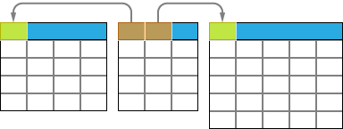
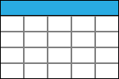
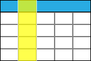
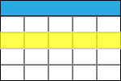
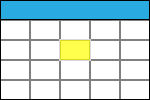

## Networked computers
### Server
A server is something which provides services to other computers or clients over a network (usually the internet). The term can mean the physical machine (hardware) or the program running on that machine (software). In web development, a server hosts websites, processes requests from clients (such as browsers), and serves web pages or data back to the clients.
Example: Apache, Nginx, or Microsoft IIS are common web servers.

### Client
A client is any device or software that requests services or resources from a server. In web development, a client is typically a web browser (like Chrome, Firefox, Edge, or Safari) that communicates with a server to retrieve web pages.
Example: When you open a website in your browser, the browser acts as the client.

## The World Wide Web
### User
The end-user who interacts with a website or web application. Users input data, click buttons, and navigate through web pages.
Example: You, as a user, are interacting with this web page right now!

### Browser
A browser is a software application that allows users to access and view web pages. It interprets HTML, CSS, and JavaScript to display web content.
Example: Chrome, Firefox, Safari, and Edge are popular web browsers.

### Server-side
Refers to processes or code executed on the server. Server-side languages (like PHP, Python, or Node.js) handle data processing, database interactions, and business logic.
Example: Processing form submissions, querying databases, and generating dynamic content.

### Client-side
Refers to processes or code executed in the user’s browser. Client-side languages (such as JavaScript) enhance interactivity and manipulate the DOM (Document Object Model).
Example: Validating form input, creating animations, and handling user interactions.

### HTML (Hypertext Markup Language)
HTML is the standard markup language for creating web pages. It defines the structure and content of a web page using [tags](#tag).
Example: `<h1>` for headings, `<p>` for paragraphs, and `<a>` for links.

### Tag
In HTML, tags are used to define elements within a web page. Tags are enclosed in angle brackets (`<` and `>`). Most tags have a matching closing tag, which is the same but with a `/` before the name. So the word *chair* here is emphasised because it is written `<emph>chair</emph>`.
Some tags, like `<input />` and ``, are self closing, and don't have a separate `</>` tag to end them.

### Form
An HTML form is a container for input elements (such as text fields, checkboxes, radio buttons) that allow users to submit data to a server.
Example: A login form with username and password fields.

### CSS (Cascading Style Sheets)
CSS is used to style and format HTML elements. It controls the layout, colors, fonts, and other visual aspects of a web page.
Example: Setting font size, background color, or margins using CSS.

### Attribute
An attribute provides additional information about an HTML element. It is specified within the opening tag of an element.
Example: The href attribute in an anchor (`<a>`) tag specifies the link destination: `<a href="https://www.google.com/">`.

### Key-value pair
A key-value pair consists of a key (or property) and its associated value. It’s commonly used in data structures like dictionaries or objects.
Example:
```json
{
    "name": "John",
    "age": 30
}
```
(where “name” and “age” are keys, and “John” and 30 are values).

### SQL
Structured Query Language (SQL) is a language used to manage and manipulate relational databases. It allows you to create, retrieve, update, and delete data.
Example: Writing queries to retrieve specific information from a database.

### Database


A database is a structured collection of data. It stores information in [tables](#table) and allows efficient data retrieval and management. Many database systems are [queried](#query) in [SQL](#sql)
Example: MySQL, PostgreSQL, or SQLite databases.

### Table


In a [database](#database), a table represents a set of related data organized into rows (called [records](#record)) and columns (called [fields](#field)).
Example: A “users” table with columns (fields) for usernames, email addresses, and passwords. Each person who is added to the table will correspond to a new row (record) with values for each of the fields.

### Field


A field (or column) in a [database](#database) [table](#table) represents a specific piece of data. Each [row](#record) contains values for each field.
Example: The “name” field in a “contacts” table.

### Row
See [record](#record)

### Record


A record (or row) in a [database](#database) [table](#table) represents a single data entry. It contains values for all the fields.
Example: A row in a “users” table would contain different pieces of information about a single user.

### Value


Also known as a cell. This is a piece of information corresponding to a single field in a single record.
### Query
A query is a request for specific data from a [database](#database). It can retrieve, filter, or modify data.
Example: "SELECT * FROM users;"
