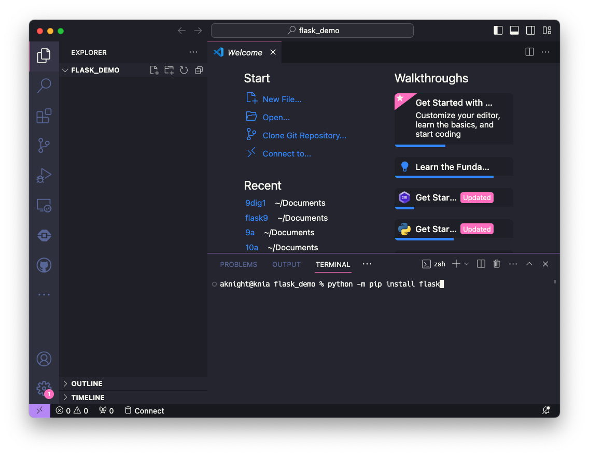
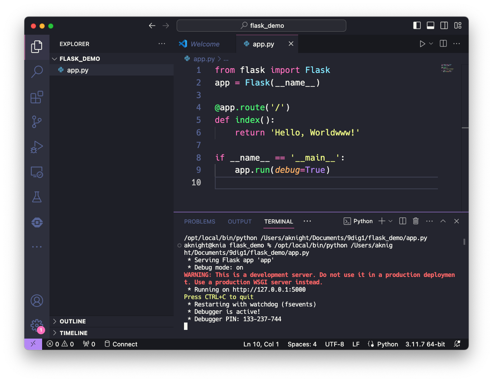
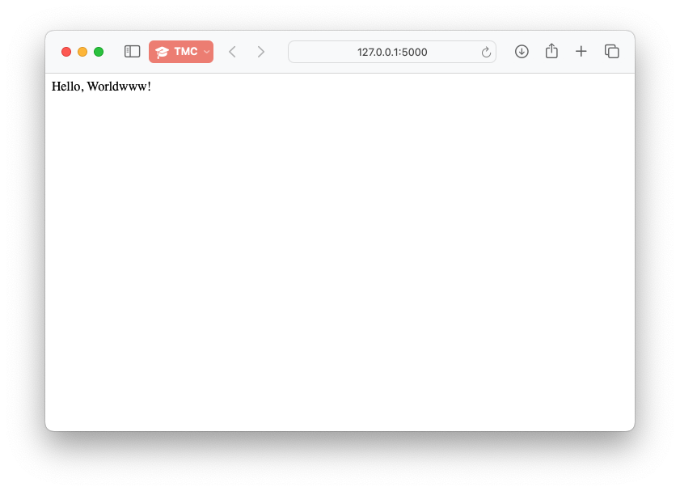

## Set up your project folder
Each web project will need to live in its own folder. In *File Explorer*, go ahead and make a folder called `flask_demo` in your Digital Tech folder now.

Open up *Visual Studio Code*, select *File > Open Folder...* (folder, not file) and choose the flask_demo folder you created.

Your window should look something like this, with the name of the project folder in the top left:



Make sure you have the *Explorer* panel open (the first icon in the *Activity Bar*). If your mouse is in the Explorer panel, you will see icons appear next to the project name to:
- create a new file
- create a new folder,
- refresh the explorer view (if for some reason things have got out of sync with the real world),
- close all the folders in the explorer view (handy sometimes when you have a million folders open and can't find anything)

## Create application file
Create a new file, call it `app.py`, and copy the following code into it:

```python
from flask import Flask
app = Flask(__name__)
 
@app.route('/')
def index():
    return 'Hello, Worldwww!'
 
if __name__ == '__main__':
    app.run(debug=True)
```

This is the simplest Flask app you can make. Let's run it now. There should be a play button in the top right. This will run your Python file. You should see something like this:



The terminal will open below your editor, if it wasn't already open, and you will see a line or two of junk which is the command that ran your script in Python. Below that you'll see some output from Flask:

```
 * Serving Flask app 'app'
 * Debug mode: on
WARNING: This is a development server. Do not use it in a production deployment. Use a production WSGI server instead.
 * Running on http://127.0.0.1:5000
Press CTRL+C to quit
 * Restarting with watchdog (fsevents)
 * Debugger is active!
 * Debugger PIN: 133-237-744
```
You'll notice that debug mode is on, which has caused the debugger to run, and there is a PIN listed. More on that later. For now, we'll focus on the line *Running on ...*. The address `127.0.0.1` is also called `localhost`, and is a special IP address which refers only to the local machine. It appears to be a real address, but isn't available to other computers. What this means is that your server is only available on *this computer*, even if the computer is on a network. This is a useful security measure when developing web-based software.

You should be able to hold the <kbd>Ctrl</kbd> key and click on the URL, and it will open in a browser window. If should say:



Let's look a bit more at what that Python code is doing.
