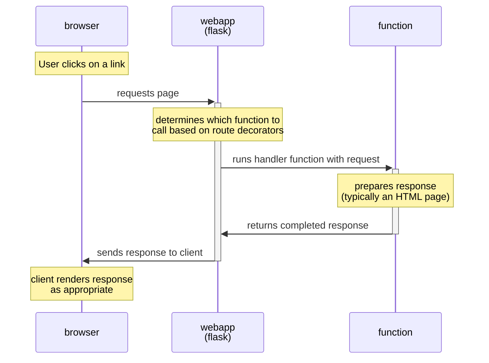

## Anatomy of a Flask app
Let's have another look at our app.py file.

```python{linenos=table}
from flask import Flask
app = Flask(__name__)
 
@app.route('/')
def index():
    return 'Hello, Worldwww!'
 
if __name__ == '__main__':
    app.run(debug=True)
```

- Line 1 imports the Flask module. As we do more things, we'll import more stuff from Flask, and add other modules as well.
- Line 2 sets up our Flask app, which is creatively called 'app'. We'll leave that alone.
- Line 8 is a piece of Python weirdness that you see a fair bit that basically translates as 'if you ran this file', and
- Line 9 actually starts our webapp. You'll notice the argument `debug=True`, which caused the debug mode to be on. There are lots of other arguments we can put in here, and we'll discuss some later.

That leaves lines 4–6 in the middle, which is where all the fun is. The first line identifies a URL pattern, and just below it is a function that should be called when a request comes in whose URL matches that pattern. Most of your app file will consist of function definitions like this with route decorators above them.

In this case '/' is the root page of any website (called the *index page*, for reasons we'll cover later), and so we've called the function `index`. You'll see it returns the text that appeared in our browser. Try changing the text and saving the file, and then refresh your browser, and it'll show your new text.

## What is going on here?


1. Your browser sends a URL request to the webapp (flask).
2. Using the route decorators, flask determines which function should handle the request.
3. Flask runs the designated function, which prepares a response.
4. The function returns the response to Flask, which then sends it back to the browser.
5. The browser looks at what type of thing has been returned and does something with it. (HTML and other text-like pages will be rendered, most other files will be downloaded to the filesystem.)

Note that, in general, the browser and the web app will be on different computers (and very often on different continents). When we are developing, we'll usually run both the client (the browser) and the server (the web app) on the computer we're sitting in front of, for convenience.
