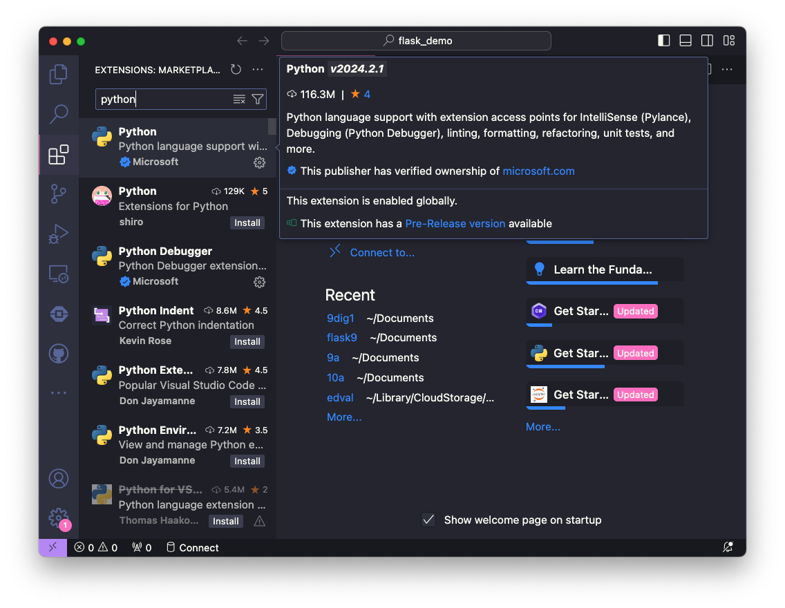
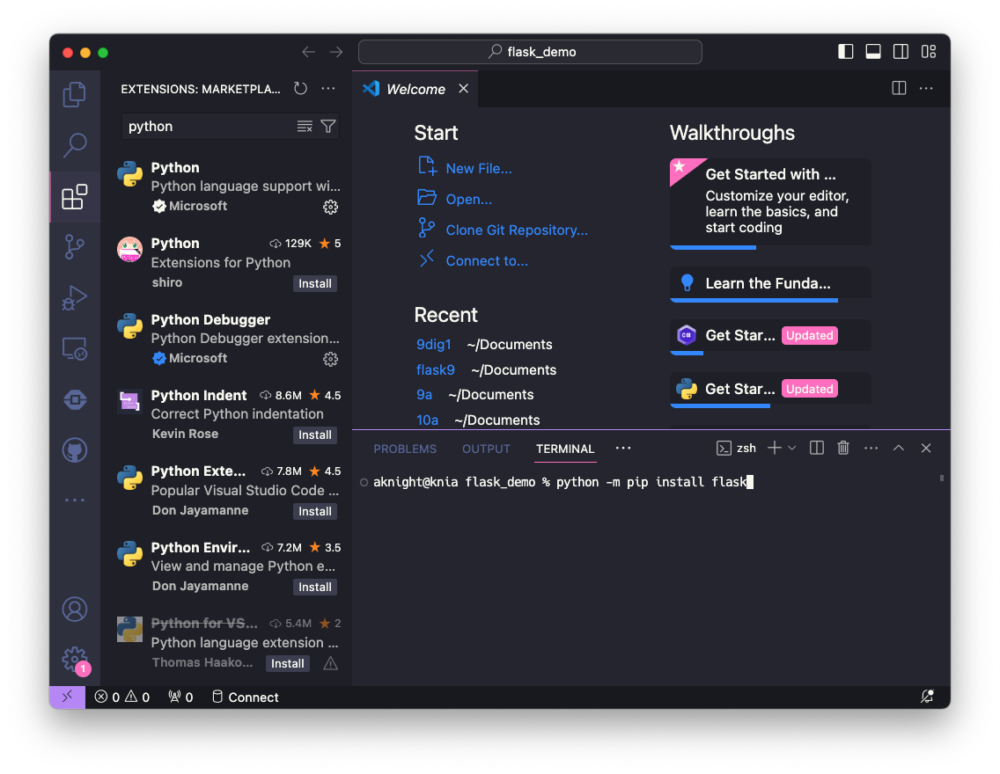

## Installation
1. From the Company Portal, install:
- Python
- Visual Studio Code

2. Open Visual Studio Code (VSC). Open the Extensions panel, and search for and install the Python extension.



3. Open a terminal in VSC (*Terminal > New terminal*), and make sure that Flask is installed. Enter the command:
```
python -m pip install flask
```


